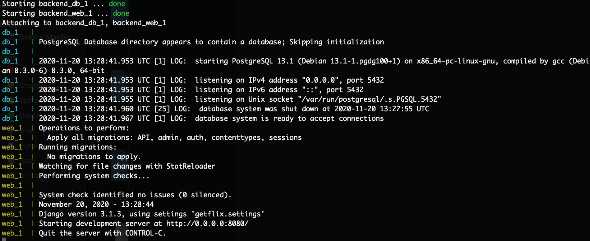

## Dockerize

1. In the secrets.json file, you should set `HOST` value by `db`

2. Start server with run command `docker-compose up`

3. If you see the screenshot below, it is working correctly.

    
    
4. You can use Postman with `http://127.0.0.1:8020/endpoint`
    
## Without Dockerize

To setup your development environment:

1. Create virtual environment `python -m venv djangoenv`

2. Activate virtual environment with `djangoenv\Scripts\activate` in Windows, or with `source djangoenv/bin/activate` in Mac OS.

3. Install all requirements `pip install -r requirements.txt`

4. "secrets.json" file will be provided, place it into folder containing manage.py

5. Create migration files `python manage.py makemigrations`

6. Handle database migrations if any `python manage.py migrate`

7. Run development server `python manage.py runserver`

