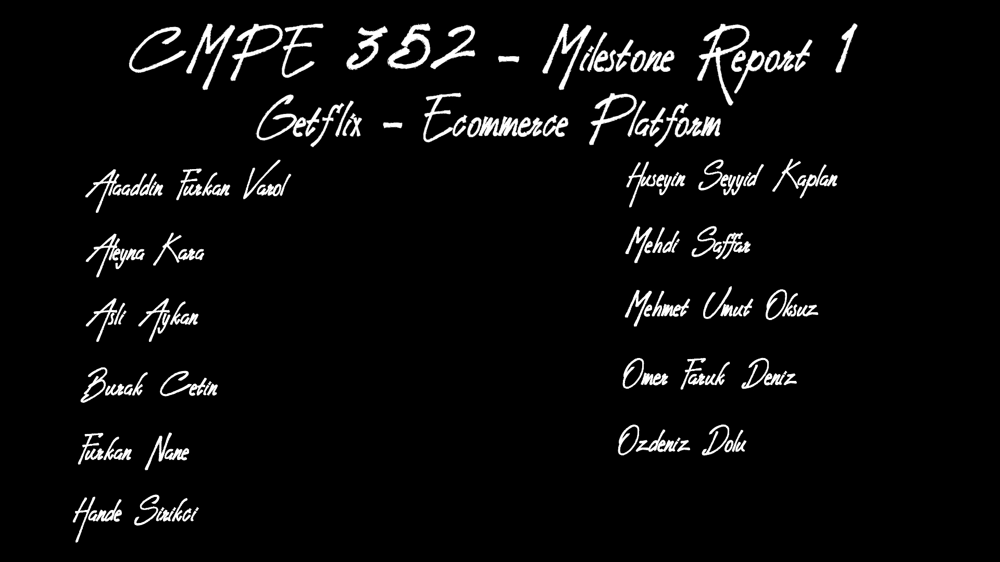

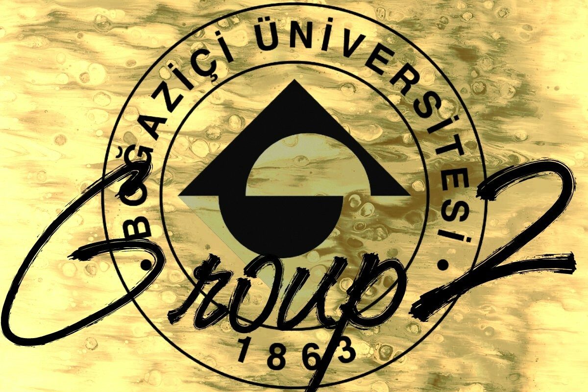

# Executive Summary
## Introduction

Getflix is an online commerce platform that helps users find a plethora of products they need and purchase them in an easy and straightforward way. Getflix removes the friction of the shopping experience by providing an easy-to-use interface on all major desktop and mobile platforms. Shoppers are able to find products with the means of semantic search, view product details and decide whether a product is worth it by reading comments by verified buyers. When their shopping cart is finalized, they can easily buy their products with debit/credit card. Getflix also gives the opportunity for buyers to track price changes so that they can strike better deals.

In Getflix there are four types of users: Guest, Customer, Vendor and Admins. Guest users are allowed to do basic operations such as searching products and viewing their details, as well as add products to their shopping cart. Customers are registered users that are allowed to continue with checking out process. They can also track their orders, ask for support from Admins and comment on products they have purchases. Vendors are allowed to setup an online shop where they can present their products on our platform. Admins maintain the system and make sure that operations go smoothly.

## What we have done so far

The very first thing we did was, naturally, to get to know each other. We learned about each other's background, exchanged contact informations and started building the infrastructure necessary for future work together. During the first week, we setup our Github repo, agreed on a communication plan, created a Slack workspace where realtime communication could happen. Each one of us researched about how to use github, picked a favorite repository and explained what we liked about it.

Every week we would meet and discuss the assigned tasks. The major task we first accomplished was creating a requirements document based on the customer's needs. This required multiple meetings, both within our team, as well as with the customer in order to better understand their needs and remove any ambiguities from the requirements.

Once the requirements were reviewed and finalized, we started working on a more visual documentation. We prepared three scenarios based on three personas which describe the archetypes of users we are expecting to see on our platform. For each user scenario, we prepared a mockup that shows how that user would be able to achieve his/her end goal on our platform. Mockups are a series of images, either on our desktop or mobile app, that shows how the user interacts with our platform to achieve the desired effect.

The next step was to create three detailed diagrams: Use case diagrams, Class Diagrams, and Sequence diagrams. These diagrams help clarify the technical aspect of the platform. It fleshes out the use cases, the potential classes (in the object-oriented sense) we might use during implementation. This brings our overview of the system to a more concrete level.

In the final week, we took the time to produce a project plan that encompasses what we have done so far as well as a best guess estimation of the tasks we will have to do in the next course. This is materialized in the project plan and the RAM (Responsiblity Assignment Matrix)

## Future work
In the next few weeks, we will practicing together as a team by implementing an API that could be used on this project. We will learn how to use git in a team setting, how to write good tests to make sure our code works as expected, and how to use AWS tools (EC2 for instance) in order to deploy our app in a production environment. Things take time, but we are perseverant and patient.

# List and status of deliverables

|     Deliverable    | Status      | Update frequency | Description                                                                                                   |
|:------------------:|-------------|------------------|---------------------------------------------------------------------------------------------------------------|
| README             | Complete    | When required    | Github README that contains a welcome message, a member list and a brief description of the project           |
| Github Wiki        | Complete    | Weekly           | Github Wiki which contains all project related resource                                                       |
| Github Issues      | Complete    | When required    | Decide on issue labels and use issues to track lifecycle of action items                                      |
| Meeting notes      | In Progress | Weekly           | Publish meeting notes which contains agenda and action items                                                  |
| Communication Plan | Complete    | When required    | Decide on mutiple communication channels. Adapt to COVID-19 situation                                         |
| Requirements       | Complete    | When required    | Analyze project and meet with customer to define the requirements                                             |
| User scenarios     | Complete    | When required    | Come up with three different personas with their stories                                                      |
| Mockups            | Complete    | When required    | Make a visual story out of the user scenarios to show the steps and user interface on the different platforms |
| Designs            | Complete    | When required    | Create Use case, Class and Sequence diagrams                                                                  |
| Project Plan       | Complete    | When required    | Publish Gantt chart of project plan for past and future tasks                                                 |
| RAM                | Complete    | When required    | Create Responsibility Assignment Matrix for past and future tasks                                             |

# Evaluation of the status of deliverables and its impact on project
## Requirements
Requirements is arguably one of the most important parts in the project because it defines the project as a whole and it guides the direction a group is heading towards with their project. Documents such as class diagrams, sequence diagrams and use-case diagrams rely heavily on having a well-prepared requirements. As a group requirements was the one of the first things we prepared and it turned out to be quite useful in any situation where we needed to look up for a functionality of our project. Also having requirements is a must in terms of establishing a healthy communication with the customer.

## Communication Plan
Communication Plan plays a very crucial part in communication between group members. Without a communication plan it is impossible to establish healthy interactions between team members because communication plan defines the mediums of interaction and guides group members to use those mediums according to the written purpose in the plan. Moreover communication plan also brings attention to communication and forces group members to think and reflect on how to establish communication in the group. Therefore communication plan brings full attention to communication and thus it maximizes the possibility of success. Our group have prepared a communication plan at the beginning of the semester and ever since it played a huge role on communication between group members and also with customer.

## User Scenarios and Mockups
User scenarios should be real-life examples, understandable by everyone and show different kinds of people with various wishes in order to prove the usability and globality of the platform. We wrote three user scenarios which are tracking, purchasing and searching. We clearly identified the personal background of different users, what the users want, the preconditions, goals and acceptance criterias for these scenarios from the requirements. Thinking of the actions step by step for the scenarios helped us to come up with new design and feature ideas for our platform which will help users to use the platform in a more efficient way.

Mockups should be realistic, demonstrate the needed functionalities for specific scenarios and show all the steps of the users from the scenarios on the platform clearly. We created two web mockups and one mobile mockup for three scenarios we wrote. We paid attention to make all these three mockups look compatible with each other. Creating mockups helped us to test the usability of the platform. Additionally, as when writing scenarios, it helped us to come up with new design and feature ideas, because it really facilitates to visualize the platform and see our abstract ideas in a clear way.

## Use-Case Diagram
The purpose of the Use-Case Diagram is to show the dynamic view of the system that is the users, the cases and the relationships among them. 
It is fundamentally designed considering the requirements of the project. 
In our Use-Case Diagram, we have 4 types of user Guest, namely the unregistered user, and Customer, 
Vendor and Admin which are registered users. The basic relationship among them is that
registered users can do anything the Guest can do other than registering since they already did.

## Class Diagram
A class diagram identifies the structure of a system by showing the system's classes, their attributes, operations, and the relation among objects. It models which classes are able to communicate with which and how ,what object we must implement, what behaviors an object is able to do and  what information an object must know and manipulate in both convenient and compact way. It can be seen as a visual representation of our requirements. Furthermore, the design of a good class diagram also affects sequence diagrams. Therefore, we attach an importance of our class diagram to be comprehensive in order to not limit our feature works. There are 29 classes and 3 enumerations in our class diagram. User hierarchy is included and all systems are separated into controllers. Authentication and authorization system check permissions of end users determined in requirements.  Classes called SearchEngine and RecommenderSystem implements the current technology to our project. 

## Sequence Diagram
We have created 10 sequence diagrams to show how and which classes interact in our application. Use cases to show in sequence diagrams are selected carefully considering selecting key use cases of our applicaton. All possible outcomes of these use cases are shown with detail in sequence diagrams. Our sequence diagrams clearly show interaction between various classes in chosen key use cases. 

## Project Plan
Creating a high level project plan that outlines the major activities and milestones helps us in  a way that tracking our progress with our plan.
The aim of the plan is to provide the work by estimating the effort and resources needed to complete the tasks  and to compare the execution. Also in this way, we are able to evaluate how we are progressing. On the other hand, it helps to answer these kind of questions:Where are we now according to plan? Where actually should we be in our project according to plan? Is there any difference and if it is, how to make up the difference?

## Responsibility Assignment Matrix
Responsibility assignment matrix is an efficient way to show all the contributions made by each group member on each task of the project. It is also very helpful while making new task distributions for next tasks by examining the matrix and realizing whether a member took too much or too few responsibilities. For a matrix to be well prepared, much attention should be paid to identifying and defining the roles well by examining the tasks and what is done so far. We created our matrix with four roles which are lead, support, reviewer and contributor, and defined these roles clearly. We paid attention to make it look compatible with project plan and Gantt chart. Since we continue to develop our project, our matrix will be also updated with new tasks and new responsibilities. Although we also identified future tasks and showed them both in Gantt chart and responsibility assignment matrix, they are open to change with changes in our task distribution or assignments we should do.

# Evaluation of Tools and Processes

## ProjectLibre (Reviewed by Mehdi Saffar)

_ProjectLibre_ is a free open-source project management software that helped me prepare the project plan as a Gantt chart. The desktop version is unfortunately very dated and buggy. There was no way to import the excel data containing the `task_name, start_date, end_date, duration, predecessors, assignees` of the project plan. It was also very finnicky to use, where errors are silent, behaviour unpredictable. I tried hacking away around its limitations, by for example imitating its copy & paste of the rows with more or less success. It also had nasty bugs where changing a cell of a row would for some reason also change the duration of a cell somewhere. This had me check each duration, and I found that almost 70% of them had changed value as I was updated the assignees column. The export to PDF also had its issues, notably the bad support of Turkish diacritics.

_ProjectLibre_ did its job, but gave me headaches personally. I wouldn't recommend to use it in the future. Other solutions should be researched

## Lucidchart (Reviewed by Aleyna Kara)

I have used Lucidchart to create the design of class diagram which includes functions, variables and classes of our project as an object oriented manner. Lucidchart has quick user interface and large amount of shapes and icons to be used in diagrams. On the other hand, you can use objects up to 60 and not be able to get much space to save documents if you don't upgrade to a paid account. 

## Balsamiq (Reviewed by Aleyna Kara)

I have used Balsamiq to create designs of mockups that share the idea of a design to stakeholders without presenting a completed design. It supports a wide range of prototypes from web prototyping to mobile UI prototyping. Since it is easy to use, one does not need to be a design expert to create wireframes using Balsamiq.

## Zoom and Slack (Reviewed by Furkan Nane)

Zoom and Slack are a part of the communication plan and they have been used heavily to communicate by our group members. Zoom is quite useful at conducting online meetings and it definitely helped our group to communicate faster than texting during covid-19 lockdown. Slack is a texting tool that offers a bunch of useful tools and it fits very nicely into group projects. 

## Excel (Reviewed by Aslı Aykan)

I have used Excel to create the responsibility assignment matrix. Excel is a popular spreadsheet program which is developed by Microsoft and part of the Microsoft Office. Because it is intended for everyone to benefit easily, it’s really easy to learn to organize, sort and filter data in rows and columns, and also to create charts&graphs. With the help of this program, I have easily divided the tasks into subgroups and used different colors for different types of responsibilities. As we continue to develop our project, I will continue to use Excel for updating the RAM with new tasks and weekly task distribution.

# Individual contributions by each member
|        Member         |                                                                                                                                                                                                                                                                                                                                                                                Contribution                                                                                                                                                                                                                                                                                                                                                                                 |
|:---------------------:|:---------------------------------------------------------------------------------------------------------------------------------------------------------------------------------------------------------------------------------------------------------------------------------------------------------------------------------------------------------------------------------------------------------------------------------------------------------------------------------------------------------------------------------------------------------------------------------------------------------------------------------------------------------------------------------------------------------------------------------------------------------------------------:|
|     Mehdi Saffar      | Created communication plan, README.md and Wiki's home page. Wrote parts of the user requirement and the glossary, reviewed multiple times. Collected questions for the customer and arranged that meeting with the help of Furkan Nane. Wrote steps of the Search scenario, and reviewed Tracking and Search mockup. Helped with Class diagram and contributed initial draft of Use case diagram. Compiled project plan into a Gantt chart twice. Regularly did house keeping of the wiki and issues. Attended all meetings, lead a few of them. Wrote Executive summary part of the milestone, review of ProjectLibre and list and status of deliverables. Created the scripts necessary to transform this milestone report from markdown to PDF file using imagemagick and pandoc. |
|    A. Furkan Varol    | I was assigned to create wiki structure. I have researched markdown and studied wiki pages of popular github repos. Then, Hande and I arranged a meeting and created the wiki structure. I have picked a github repo I like and contributed to Repositories We Liked page. I created User Scenario #2 Purchase. While preparing the scenario, I reviewed User Requirements and also System Requirements, contributed and modified some. I opened and closed github issues for task that assigned to me or a group I am part of. During lockdown, I couldn't contributed to the project as much, because I had problems. I will start taking my part back again in the project as soon as possible.                                                                                                                                                                                                                                                                                                                                                                                                                                                                                                                                                                                                                                                                                                                                                                      |
|      Aleyna Kara      |   First week, I have created Wiki home page. I have designed a logo to customize our home page. I have researched Github, markdown syntax and repository,namely Flutter. After my research, I have created my personal wiki page. Since my job was the revision of requirements, I have researched requirement engineering and then written important parts on my own words as a wiki page for better understanding at the second week. Then, I have styled requirements page with HTML. I have both added and changed some parts,e.g. catagory names, definitions in glossary. Then, I have designed searching mock up. After that, I have created tracking mock up due to the feedback and my experience with Balsamiq. Also, I have edited meeting notes like adding numbers of issues after same feedback. I have determined almost all classes, variables and functions of class diagram and then organized into a class diagram using LucidChart. Furthermore, I have contributed the design part of the project as creating four sequence diagrams. I have been contact with Aslı Aykan to help her to integrate our project as a new team member. Then, we created RAM with Aslı Aykan. I have reviewed not only issues but also all commits of my teammates in order to be fair. In addition, I have designed our new logo. Also, I am one of the person who cares the look of our wiki pages. So, I have tried to stay our wiki pages up-to-date adding some gifs etc. Last, I have written not only the evaluation part of class diagram but also review about Balsamiq and Lucidchart in Milestone 1 Report.                                                                                                                                                                                                                                                                                                                                                                                                                                                                                                                                                                                                                                                                                                                                                                   |
|      Aslı Aykan       |   Joined the project group after the first 1.5 months of the spring term. Created my personal wiki page, contributed to Repositories We Liked and Git&Github pages. Reviewed almost all the works done by my friends before joining the group which are requirements, glossary, scenarios, mockups, and diagrams. Read all the past feedbacks and contributed on the searching scenario accordingly. Created some logos for our e-commerce platform and opened a poll for all logo ideas of the group. Created responsibility assignment matrix with Aleyna Kara by reviewing project plan and Gantt chart, and continued to update it. Recreated the purchasing scenario mockup with Balsamiq to make it compatible with other mockups which are also created with it. Attended all the meetings after joining the group. Wrote the evaluations of scenarios&mockups and RAM, and also review of Excel for the Milestone 1 Report.                                                                                                                                                                                                                                                                                                                                                                                                                                                                                                                                                                                                                                                                                                                                                                        |
|      Burak Çetin      |    Attended the physical meetings that happened before the covid-19 lockdown and contributed in the brainstorming sessions. I was assigned the task of visualizing the mockups but in the end Aleyna did them for practical reasons and consistency. Took the role of the moderator when we were deciding the name for our project and provided ideas on the logo as well. After the lockdown I had personal problems with motivation and could not contribute much to the first milestone but I am currently up to date with our project and hoping to accomplish more and take on more tasks.                                                                                                                                                                                                                                                                                                                                                                                                                                                                                                                                                                                                                                                                                                                                                                 |
|      Furkan Nane      |     I prepared the communication plan. I attended the customer meeting, created the user requirements part of the requirements and involved in revision of requirements. I created the tracking user scenario. I involved in creation of the class diagram. I involved in creation of the project plan. I attended all of the meeetings, tried to coordinate the group, tried to unfold the assignments by asking questions to the Meriç Turan. I wrote the evaluation of requirements,communication plan, zoom and slack parts of the Milestone 1 report.                                                                                                                                                                                                                                                                                                                                                                                                                                                                                                                                                                                                                                                                                                                                                                        |
|     Hande Şirikçi     |     During the time that we were working on completing Milestone1, approximately whole semester;  I attended all meetings and have taken meeting notes in most of them. The first task assigned to me was about Wiki Structure. I tried to classify things in wiki and learned how to use it.  I reviewed and corrected project requirements, especially non-functional part of it.I created tracking scenario, by this way we have already prepared the break points of some cases. I attended diagrams ps in order to learn about them and inform other members about diagrams by sending my notes. I was involved in creation of class diagram, tried to decide on class hierarchies and had a meeting about it. I have also been assigned to create  our high level project plan, regularly update it.I wrote the evaluation of Project Plan part of Milestone1 Report. I used sharable documents while working, opened issues for each task and created channels on slack for each task that we do together in order to synchronize with my group members, to keep in touch. I was always aware that this class is not just about completing tasks before deadlines but rather about good communication between us.|                                                                                                                                                                                                                                                                                                                                                                                                                                                                                                                                                                                                                                                                                                                                                                         |
| Hüseyin Seyyid Kaplan |      Determined the tags, labels and colors as 24 labels in addition to 9 default GitHub labels.  Prepared my own wiki-page(to includes parts of About, Skills and Contact) on GitHub. Searched for useful Github repositories that most of people benefit from on web and when I skimmed over lists of repo’s I picked one of them that I liked. Created a page for GitHub repositories that I liked. Studied git as a version management system and watched a video that is recommended to us. Analysed the websites about commercial platform like N11, hepsiburada, Amazon, sahibinden. Created purchasing mockup via Mockflow. Created agenda files for adding issues of week on Wiki pages. Worked on designing a logo and searched several sites. Used brandmark.io to create a logo.                                                                                                                                                                                                                                                                                                                                                                                                                                                                                                                                                                                                                                                                                                                                             |
|   Mehmet Umut Öksüz   |      I have prepared a doodle poll to decide out permanent meeting time in the very first week. I have written non-functional requirements part of requirements. And I also have reviewed functional requirements and given feedback to my team. I have contributed to Purchasing scenario of our project and reviewed mockups. I have also designed some logo ideas for my team and contributed to decision of project name. After we get the feedback of requirements v1.0, I have done some changes on requirements accordingly. I have drawn 4 of our sequence diagrams. I contributed to our project plan using ProjectLibre software. I have written evalution of sequence diagrams. I have attended most of our group meetings.                                                                                                                                                                                                                                                                                                                                                                                                                                                                                                                                                                                                                                                                                                                                                                       |
|   Ömer Faruk Deniz    |  To consistently follow the updates, I attended all meetings from the beginning of the semester and tried to take active duties. At the beginning, I researched about the Git as a Version Management System. I created my own Wiki page after learning using Markdown. I researched and examined several repositories to present in our Wiki and then added Scikit-Learn to our Wiki page as an example. I designed our Labels by putting great effort to choosing names, colors and explanations as catchy as possible. I involved in the requirements revision. I designed the user story, preconditions and the acceptance criteria of the Searching Scenario and reviewed the completed versions of Searching, Purchasing and Tracking Scenarios. I also designed the initial draft of the Use-Case diagram with my team, done extensive review and reimplemented it with creately.com from scratch. I also reviewed and implemented new features according to the given feedback. I also designed the paper-version of the Vendor adding a new product to help the Sequence Diagram team. I wrote the Use-Case Diagram related parts of the Milestone Report and my individual contributions. And finally and maybe most importantly, I consistently checked and updated our Wiki page neatness of which is crucial for our team.                                                                                                                                                                                                                                                                                                                                                                                                                                                                                                                                                                                                                                                                                                                                                                           |
|     Özdeniz Dolu      | Arranged meeting locations in CmpE building for first 2-3 meetings                                                                                                                                                                                                                                                                                                                                                                                                                                                                                                                                                                                                                                                                                                                                                                            . Created my personal wiki page. Contributed to the System Requirements and Glossary. I have created a template for a mock-up, which then revised and made into a new mock-up. I have created two sequence diagrams and revised them later on considering the feedbacks. I have taken meeting notes for two meetings. I mainly attended the group meetings. Me and Hande Şirikçi have created the second half of the first part of the project plan|

# Communication plan

| Communication Channel |                               Purpose                               |  Frequency   |  Participants |
|-----------------------|:-------------------------------------------------------------------:|:------------:|--------------:|
| Slack                 |   Will be used as main text and video call communication channel    | Open Channel |    Whole Team |
| Github                | Main channel where the project develops, includes all documentation | Open Channel |    Whole Team |
| CMPE building         |               Face to face meetings will be held here               | Once a week  |    Whole Team |
| Piazza                |          Communication with the customer will happen here           | Open Channel | Communicatior |
| Zoom                  |           Online team communication and online education            |  Appointed   |    Whole Team |

# Requirements
## 1. Functional Requirements

<ul>

 <strong>  1.1. User Requirements </strong> 

* **1.1.1 Sign Up**

  + **1.1.1.1** Customer, Vendor users shall be able to sign up to the system via one of the following methods:

    - **1.1.1.1.1** Regular sign up
    - **1.1.1.1.2** Google sign up

  + **1.1.1.2** Customer, Vendor and Admin users shall be able to use regular sign up by providing the following required information:

    - **1.1.1.2.1** Username
    - **1.1.1.2.2** Password
    - **1.1.1.2.3** E-mail
    - **1.1.1.2.4** Name
    - **1.1.1.2.5** Surname
    - **1.1.1.2.6** Location (not mandatory for customers)

  + **1.1.1.3** Vendor users shall enter at least one location, while Customer shall be able to enter location information if they wish to

  + **1.1.1.4** Customer and Vendor users shall verify their account via a link sent by the system to their e-mail account before being able to checkout a cart.

  + **1.1.1.5** Guest users must read and accept the Terms of Services to be able to sign up.

* **1.1.2 Login**

  + **1.1.2.1** Registered Users who signed up with their Google account shall be able to login with their Google account

  + **1.1.2.2** Registered Users who signed up with a regular signup shall be able to login by providing the following information.

    - **1.1.2.1.1** Username
    - **1.1.2.1.2** Password

* **1.1.3 Search**

  * **1.1.3.1**  Guest and Registered Users shall be able to perform a semantic search for a product over:
      * **1.1.3.1.1** Name of the product
      * **1.1.3.1.2** Description of the product
      * **1.1.3.1.3** Type of the product
      * **1.1.3.1.4** Vendor of the product

  + **1.1.3.2 Filter**

    * **1.1.3.2.1** Guest and Registered Users shall be able to filter the products according to:  
     
      * **1.1.3.2.1.1**  Product's Average customer review (Product rating)
      * **1.1.3.2.1.2**  Product vendor
      * **1.1.3.2.1.3**  Product brand
      * **1.1.3.2.1.4**  Product price range

  + **1.1.3.3 Sort**

    - **1.1.3.3.1** Guest and Registered Users shall be able to sort the products according to:  

      * **1.1.3.3.1.1**  Best sellers
      * **1.1.3.3.1.2**  Newest arrivals
      * **1.1.3.3.1.3**  Price
      * **1.1.3.3.1.4**  Average customer review (Rating)
      * **1.1.3.3.1.5**  Number of comments

  + **1.1.3.4** Guest and Registered Users shall be able to see the information below about the products they searched:

      * **1.1.3.4.1**  Product type
      * **1.1.3.4.2**  Product picture
      * **1.1.3.4.3**  Price
      * **1.1.3.4.4**  Product vendor
      * **1.1.3.4.5**  Average Customer Review (Rating)
      * **1.1.3.4.6**  Comments about the product
      * **1.1.3.4.6**  Description about the product
      
  
  + **1.1.3.5** Guest and Registered Users shall be able to see the information below about the vendors they searched:

      * **1.1.3.5.1**  Company name or personal name
      * **1.1.3.5.2**  Company logo picture or personal picture
      * **1.1.3.5.3**  Average customer review (Rating)
      * **1.1.3.5.4**  Products of this vendor
      * **1.1.3.5.5**  Comments about the vendor
 
  + **1.1.3.6** Guest and Registered Users shall be able to search a product by entering their name or type.

  + **1.1.3.7** Guest and Registered Users shall be able to search a vendor by entering their name.

* **1.1.4 Product Details**

  + **1.1.4.1** Guest and Customer users shall be able to see a product's or a vendor's information even if they did not search for the product. **1.1.3.4** and **1.1.3.5** specifies what information users shall be able to see.

  + **1.1.4.2** Vendor users shall be able to update the product's detail information

  + **1.1.4.3** Vendor users shall specify the stock information of a product. This requires:
    - Stock status information: `Available`, `Out of Stock`, `Online only`
    - Locations to which the product is deliverable.

* **1.1.5 Comment**

  + **1.1.5.1** Customer users shall be able to comment on a product only if they have purchased that product.
  + **1.1.5.1** Customer users shall be able to comment on a vendor only if they have purchased a product from that vendor.
  + **1.1.5.2** All users shall be able to see the comments about a product or a vendor.
  + **1.1.5.3** Vendor users shall be able to reply to comments.
  + **1.1.5.4** Customer users shall be able to like or dislike comments.

* **1.1.6 List**

  + **1.1.6.1** Customer users shall be able to create a list of products they would like to keep an eye on.
  + **1.1.6.2** Customer users shall be able to name their lists.
  + **1.1.6.3** Customer users shall be able to edit their lists.
  + **1.1.6.4** Customer users shall be able to delete their lists.

* **1.1.7 Shopping Cart**

  + **1.1.7.1** Guest and Customer users shall be able to add products to their shopping carts.
  + **1.1.7.2** Guest and Customer users shall be able to edit their shopping carts.
  + **1.1.7.3** Guest and Customer users shall be able to view their shopping carts.
  + **1.1.7.4** Guest users shall be able to checkout their shopping cart only after creating a Customer user account with a Quick registration option.
  + **1.1.7.5** Customer users shall be able to checkout their shopping cart only after verifying their account. Please look at **1.1.1.4** and the glossary for details about Account verification.

* **1.1.8 Order**

  + **1.1.8.1** Customers shall be able to see their active (not delivered) orders with their status.
    + **1.1.8.1.1** Status shall be `At store` or `At cargo`.

  + **1.1.8.2.1** Guest and Customers shall be able to see their delivered orders with information according to:

    + **1.1.8.2.1** Order date
    + **1.1.8.2.2** Selling price
    + **1.1.8.2.3** Cargo tracking ID
    + **1.1.8.2.4** Cargo tracking link
    + **1.1.8.2.5** Estimated delivery date

  + **1.1.8.3** Customers shall be able to cancel their active orders that have the `At store` status.
  + **1.1.8.4** Customers shall be able to return their delivered orders.
  + **1.1.8.5** Customers shall be able to see the total amount they spent on orders.
  + **1.1.8.6** Vendors shall be able to cancel an order during the order processing stage when vendors face a problem related to their order. In such case, the Vendor is required to:
    - specify the reason of the cancellation
    - specify their refund policy

* **1.1.9 Direct Messaging**

  + **1.1.9.1** Customers shall be able to communicate with the vendors or admins about orders via direct message.
  + **1.1.9.2** Vendors shall be able to communicate with the customers or admins about a certain product or order via direct message.

* **1.1.10 Notifications**

  + **1.1.10.1** Customers shall be able to choose to get notified whenever the price of any product in their list changes.
  + **1.1.10.2** Customers shall be able to choose to set an alarm for a certain price threshold in order to be notified about whether the price of selected product downs below the threshold price.

* **1.1.11 Customer Review**

  + **1.1.11.1** Customers shall be able to rate a product they have "bought and received".
  + **1.1.11.2** Customers shall be able to rate a vendor from which they have "bought and received" a product.

* **1.1.12 Purchase**

  + **1.1.12.1** Customer users shall be able to purchase the products in their shopping cart by using one of the following payment methods:.
    + **1.1.12.1.1** Debit card
    + **1.1.12.1.2** Credit card

  + **1.1.12.2** Customer users shall agree to the contract of sale before proceeding with the payment.
  + **1.1.12.3** Customer users shall be able to see if the payment is successfully completed or not.

* **1.1.11 Online Shop**
  + **1.1.11.1** Vendor users shall be able to open an online shop
    + **1.1.11.1.1** Vendor users shall be able to put the following information in their online shop:
        + **1.1.11.1.1.1** Vendor information
        + **1.1.11.1.1.2** Active products
        + **1.1.11.1.1.3** Location of physical stores (if any)
    + **1.1.11.1.2** Vendor users should be able to customize the online shop to their liking. 

</ul>
<ul>

 <strong> 1.2. System requirements </strong> 

* **1.2.1** The system shall have 4 different user types:

  + **1.2.1.1** Guest
  + **1.2.1.2** Customer
  + **1.2.1.3** Vendor
  + **1.2.1.4** Admin

* **1.2.2 Signup Functionality**

  + **1.2.2.1** The system shall provide Regular signup and Google signup.
  + **1.2.2.2** The system shall require acceptance of Terms of Service by the user before continuing with the signup processing.
  + **1.2.2.3** The system shall not allow Guest users to checkout their shopping cart
  + **1.2.2.4** The system shall confirm the user email by sending a link to the email account and receiving a confirmation from the user.
  + **1.2.2.5** The system shall not allow unverified Customer account to checkout their shopping cart
  + **1.2.2.6** The system shall only let confirmed users make transactions. Confirmation is via Google or e-mail.

* **1.2.3 Search Functionality**

  + **1.2.4.1** The system shall provide a semantic search functionality which finds products and vendors based on contextual information. The information shall be looked for in 
  
    + **1.2.4.1.1** Product title
    + **1.2.4.1.1** Product description
    + **1.2.4.1.1** Product details

  + **1.2.3.2** The system shall be able to filter search results according to:

    * **1.2.3.2.1**  Average customer review of the product
    * **1.2.3.2.2**  Vendor of the product
    * **1.2.3.2.3**  Brand of the product
    * **1.2.3.2.4**  Price range of the product

  + **1.2.3.3** The system shall be able to sort search results according to:

    * **1.2.3.3.1**  The rate of sale 
    * **1.2.3.3.2**  Arrival time
    * **1.2.3.3.3**  Price
    * **1.2.3.3.4**  Average customer review
    * **1.2.3.3.5**  Number of comments

* **1.2.3** Products in the system may be discovered in various categories:

  + **1.2.3.1** Arts & Crafts
  + **1.2.3.2** Automotive
  + **1.2.3.3** Baby 
  + **1.2.3.4** Beauty & Personal Care 
  + **1.2.3.6** Books
  + **1.2.3.7** Boys' Fashion
  + **1.2.3.8** Computers
  + **1.2.3.9** Camera & Photo
  + **1.2.3.10** Cell Phones & Accessories
  + **1.2.3.11** Digital Videos
  + **1.2.3.12** Electronics
  + **1.2.3.13** Furniture
  + **1.2.3.14** Girls' Fashion
  + **1.2.3.15** Health & Households
  + **1.2.3.16** Home & Garden
  + **1.2.3.17** Industrial & Scientific
  + **1.2.3.18** Luggage
  + **1.2.3.19** Men's Fashion
  + **1.2.3.20** Movies & TVs
  + **1.2.3.21** Music & CDs
  + **1.2.3.22** Pet Supplies
  + **1.2.3.23** Software
  + **1.2.3.24** Sports & Outdoor
  + **1.2.3.25** Toys & Games
  + **1.2.3.26** Video Games
  + **1.2.3.27** Women's Fashion

* **1.2.4** The system shall distinguish between same products that are sold by different vendors.

* **1.2.5 Product List Functionality**

  + **1.2.5.1** Product Lists created by users shall be private.

* **1.2.6** The system shall have a shopping cart functionality.

* **1.2.7 Order Functionality**

  + **1.2.7.1** System shall show the following information about past orders:

    - **1.2.7.1.1** Order date
    - **1.2.7.1.2** Product price
    - **1.2.7.1.3** Cargo information (Cargo tracking ID and a link to the tracking page)
    - **1.2.7.1.4** Delivery date
    - **1.2.7.1.5** Order status

  * **1.2.7.2** The system shall accept transactions made only with Credit Card or Debit Card.

* **1.2.8 Price Tracking Functionality**

  + **1.2.8.1** The system shall track changes in the prices of the products and alert users if requested.

* **1.2.9 Notification Functionality**

  + **1.2.9.1** The system shall notify users of direct messages.
  + **1.2.9.2** The system shall -if requested- notify users of price changes.
  + **1.2.9.3** The system shall -if it is set- notify users of price alarms.
  + **1.2.9.4** The system shall notify users of changes in order status.
  + **1.2.9.5** The system shall -if requested- notify users of sales and campaigns.

* **1.2.10 Recommendation Functionality**

  + **1.2.10.1** The system shall recommend certain products to the users based on their interactions on the platform.

* **1.2.11 Direct Messaging Functionality**
  + **1.2.11.1** The system shall provide direct messaging functionality between customers and vendors.
  + **1.2.11.2** The system shall provide direct messaging functionality between admin users and registered users for support.

* **1.2.12** The system provides a like and comment functionality but only to the users whose products has been delivered.

* **1.2.13 Product Details Functionality**

  + **1.2.13.1** The system must keep track of the history of product information updates made by Vendors to avoid Vendors changing product information after bad reviews from Customers. 

</ul>

## 2. Non-Functional requirements

<ul>

 <strong> 2.1. Availability and Accessibility </strong> 

  + **2.1.1** The system should work on wide range of web browsers (Chrome, Firefox, Safari, Microsoft Edge, Opera).
  + **2.1.2** The mobile app shall be developed natively for Android 7 and newer versions.
  + **2.1.3** Customer and Vendor users shall be able to verify their account via a link sent by the system to their e-mails.

</ul>
<ul>

 <strong>2.2. Performance </strong> 

  + **2.2.1** System should be responsive (5 seconds in the worst case).
  + **2.2.2** Android application should be optimized well to work smoothly with lower hardware resources.

</ul>
<ul>

 <strong>2.3. Security </strong> 

  + **2.3.1** Authentication and authorization shall always be done in the server side.
  + **2.3.2** Passwords should be hashed and salted to prevent accounts to be stolen in a database injection.
  + **2.3.3** Input to the system shall be properly validated.
  + **2.3.4** Sensitive data (such as passwords) should always be encrypted in requests.
  + **2.3.5** After 3 unsuccessful login attempts, owner of the account shall be informed via e-mail by the system.

</ul>
<ul>

 <strong>2.4. Protocols and Privacy </strong> 

  + **2.4.1** Rules defined by [GDPR](https://eur-lex.europa.eu/legal-content/EN/TXT/PDF/?uri=CELEX:32016R0679) and [KVKK](https://www.mevzuat.gov.tr/MevzuatMetin/1.5.6698.pdf) and shall be followed strictly when developing the system.
  + **2.4.2** The implementation of the system should follow [the standards introduced by the World
Wide Web Consortium (W3C)](https://www.w3.org/standards/)
  + **2.4.3** W3C Activity Streams protocol should be supported by the system.
  + **2.4.4** Privacy policy should be defined exactly and shown to users in registration process and users will be forced to accept it to complete registration.
  + **2.4.5** Distant sales contract should be defined clearly according to regulations, and customers shall be forced to accept it before purchasing any goods.

</ul>
<ul>

 <strong> 2.5. Development and Publish </strong> 

  + **2.5.1** System shall be deployed to Amazon EC2 servers or Digital Ocean.
  + **2.5.2** System shall be dockerized to ease development process.
  + **2.5.3** System shall have monthly periodic maintenance operations.

</ul>

# Mockups
## [User Scenario 1](https://github.com/bounswe/bounswe2020group2/wiki/User-Scenario-%231)
In this scenario Ergin Özdemir is a 20 years old university student. He ordered a guitar and has been waiting for it for 5 days. He gets worried and tries to get information.

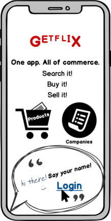

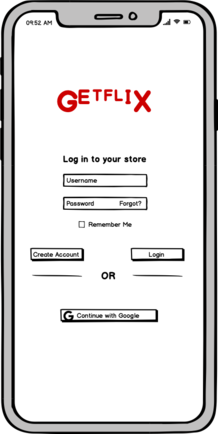

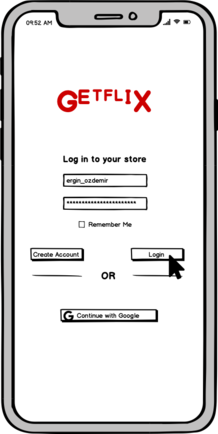

### Ergin goes to orders page to see his order's status.

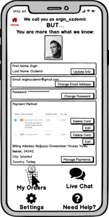

### Ergin sees that his order's status is "at cargo" and then goes to the page of the vendor of the product.

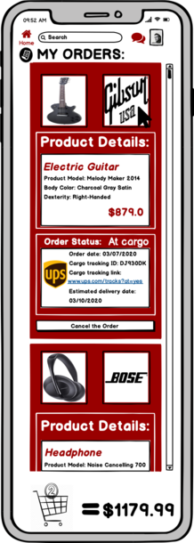

### Ergin goes to comment section of the vendor.

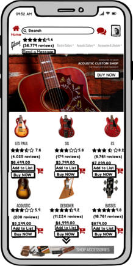

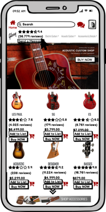

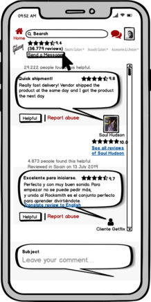

### Ergin direct messages the vendor about the delivery.

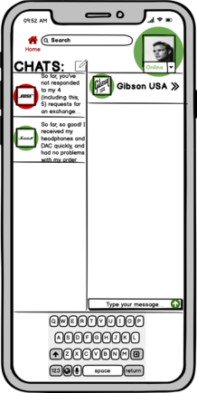

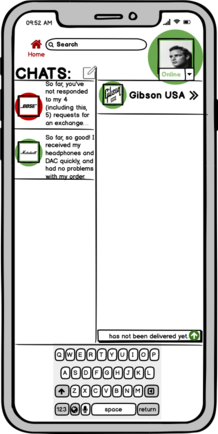

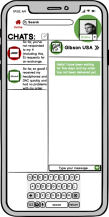

### Vendor responds back with via direct message.

## [User Scenario #2](https://github.com/bounswe/bounswe2020group2/wiki/User-Scenario-%232---Purchase)
In this scenario Alper Keten is a 32 years old architect. He has an old PC and architecture design softwares do not run smooth on his current PC. He has been saving money to buy a better PC for buying new one.

### 1.Alper is already logged in, and he goes to Electronics -> Computers -> Notebooks page using navigation.
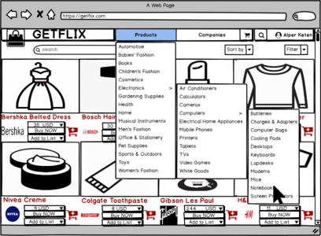

### 2.Alper filters products by brand.
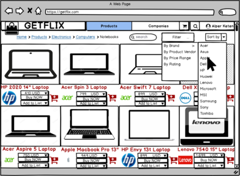

### 3.Alper sorts by price, ascending.
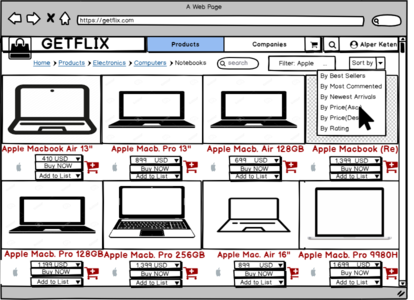

### 4&5.Alper goes to the page of a specific computer he wants to purchase and looks at the rating of the product.
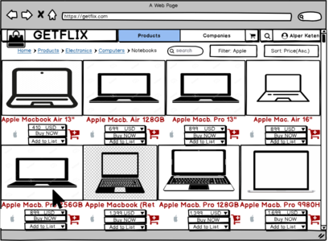
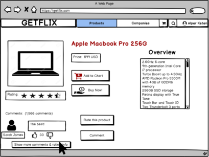

### 6&7.Alper goes to the comments section, reads some comments and sees most is satisfied with this product and adds the product to the shopping cart.
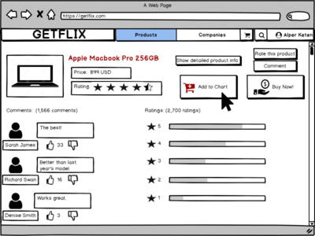

### 8&9.Alper goes to shopping cart page and gives his address info for shipment and payment info then completes the purchase.
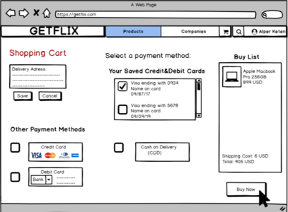

## User Scenario #3:
> In this scenario,
> Murat Yılmaz is a 22 years old engineering student. 
> He decides to buy a tablet.

### Murat logins as a customer by clicking on login button

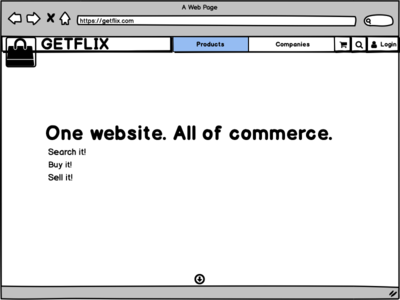

### He decides to login with his Google account by clicking on Login with Google button

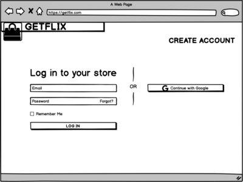

### He gets transferred to the Google login UI. He enters his email and password and clicks continue

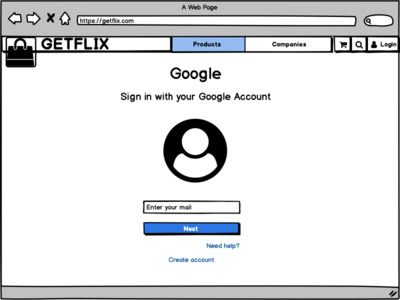

### He gets transferred back to the homepage and can verify that he is logged in by seeing his username and profile picture in the top right corner of the page

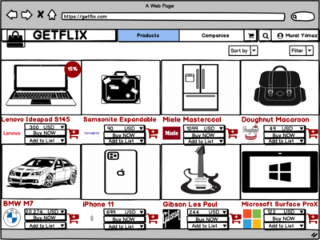

### He clicks on the search bar and starts typing

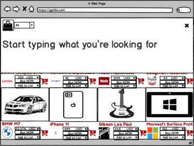

### As soon as he starts typing, the bottom half of the page fades out and gives "semantic search" suggestions to the user.

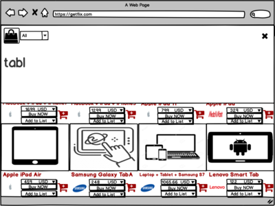

### He presses enter to confirm his search query and after a moment the results are listed

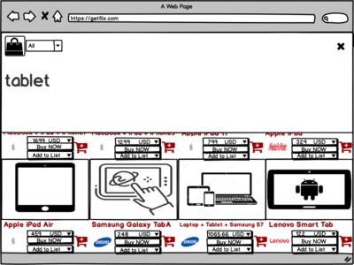

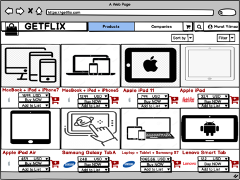

### He cannot immediately find the result he is looking for, therefore he adds price range as filter from filters

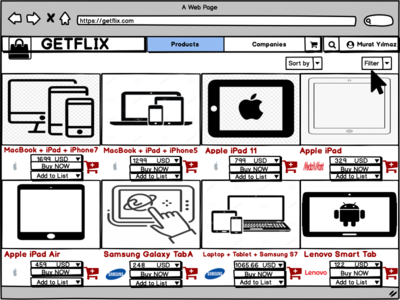

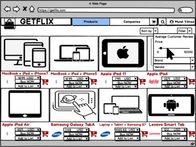

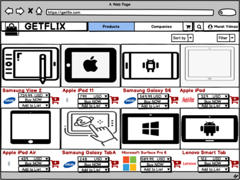

### He chooses the bestseller for sorting from the dropdown.

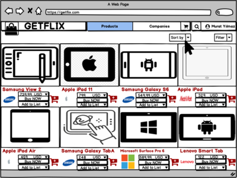

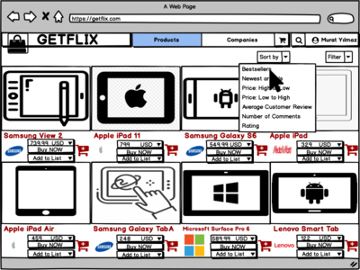

### He finds a product that fits him in terms of price in the second result cell. 

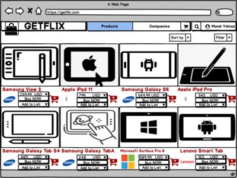

### He checks out the different pictures of the product by hovering over the image and waiting for a few milliseconds. When hovering long enough, pictures start cycling.

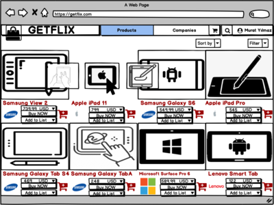

### He clicks on the product and is led to the product detail page where he can analyze the product, read the comments and see if it corresponds to what he is looking for exactly. 

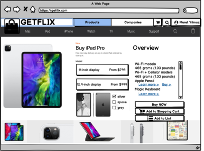

# Design

## Use-Case Diagram

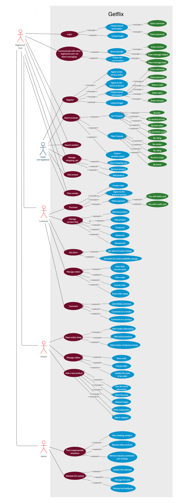
## Class Diagram

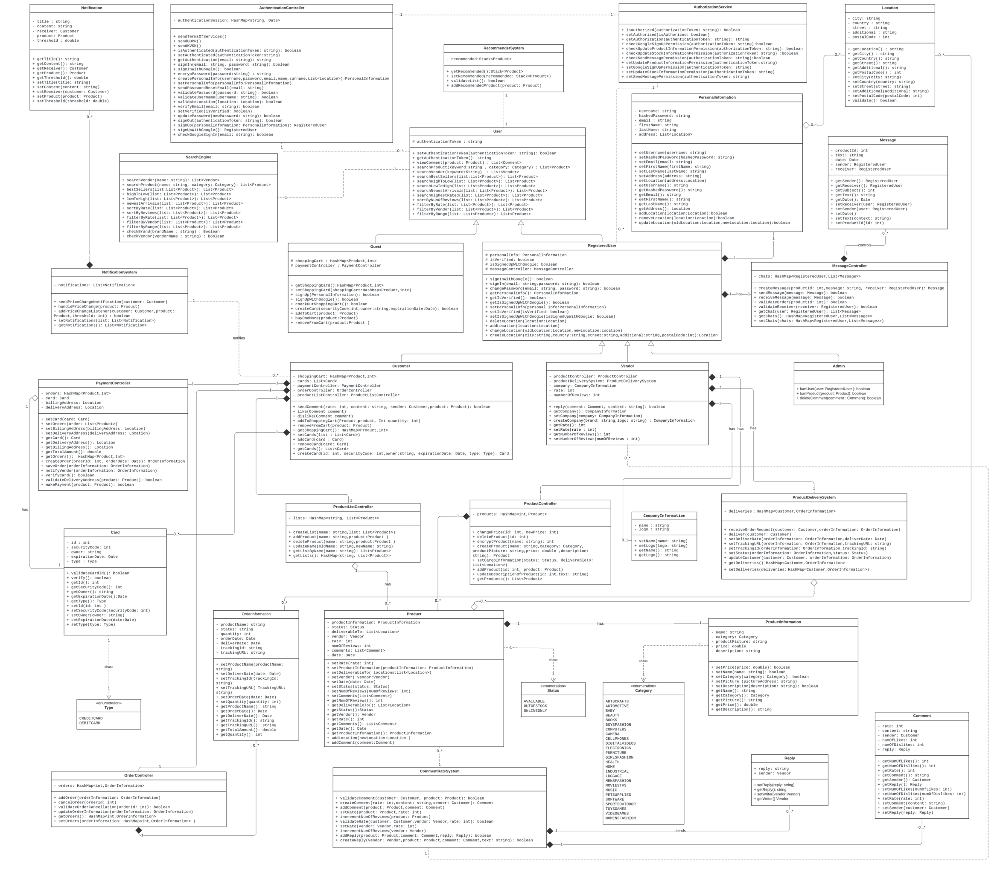

## Sequence Diagrams

### Guest tries to buy product in his or her shopping cart.

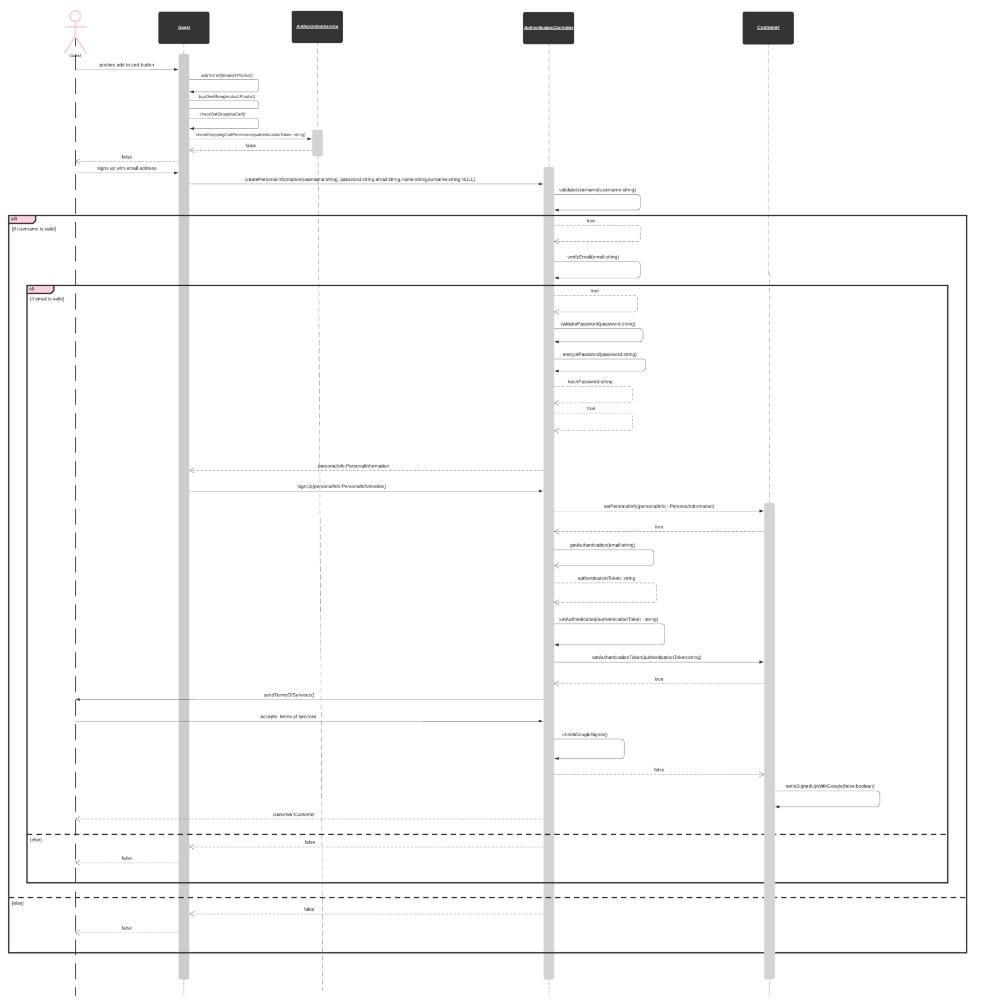

### Customer adds comment to his or her delivered order.

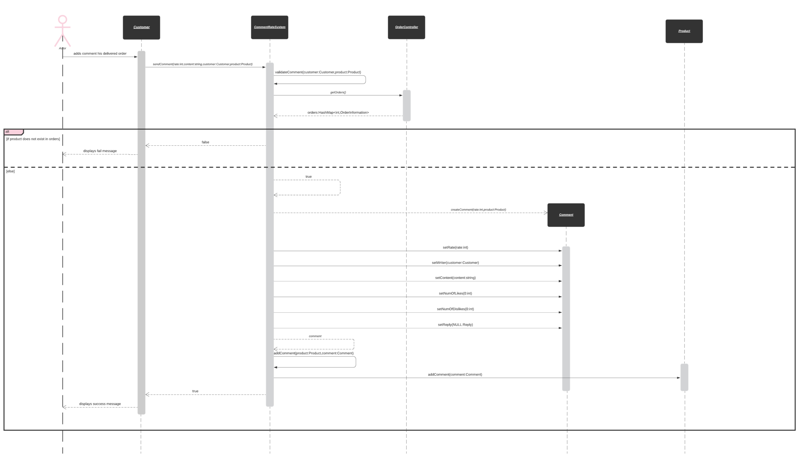

### Customer sends message to the vendor of his or her order.

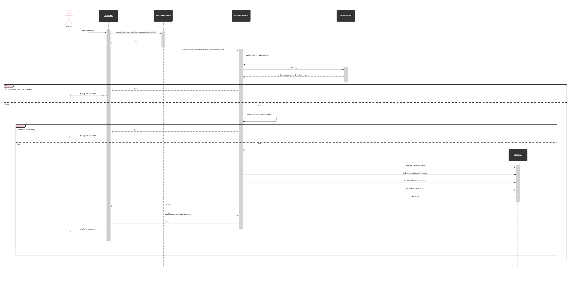

### Customer checks out his or her shopping cart.

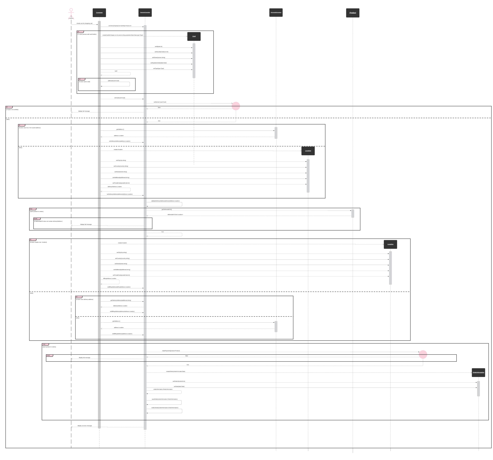

# Project Plan

<!-- [ -->

# Responsibility Assignment Matrix

<!--  -->

